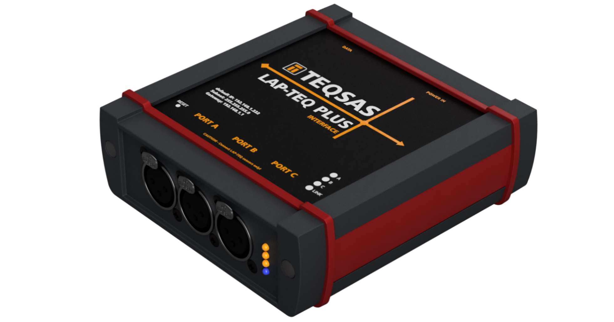

# TEQSAS LAP-TEQ PLUS INTERFACE

{ width=480 }

Dies ist die Sammlung der Dokumente für das TEQSAS LAP-TEQ PLUS INTERFACE.

-   :octicons-book-16: __Bedienungsanleitung__

    ---

    [Zum Handbuch](./Manual/manual_1.md)

-   :octicons-code-16: __HTTP-API__

    ---

    [Zur API-Referenz](./API/INTERFACE_API.md)

-   :octicons-shield-check-16: __CE-Konformität__

    ---

    [Zur Erklärung](./Manual/manual_ce.md)

-   :octicons-graph-16: __Technische Daten__

    ---

    [Zu den Daten](./Manual/manual_11.md)

-   :octicons-download-16: __Download__

    ---

    [Zu den Downloads](../downloads/index.md?q=INTERFACE)

