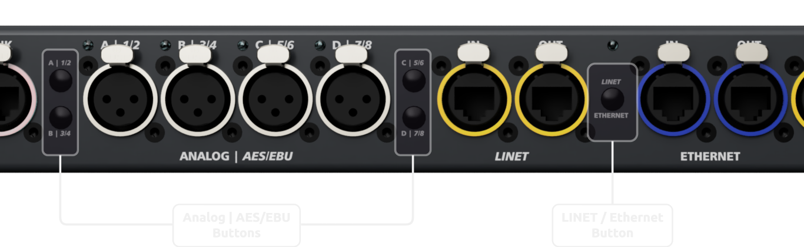
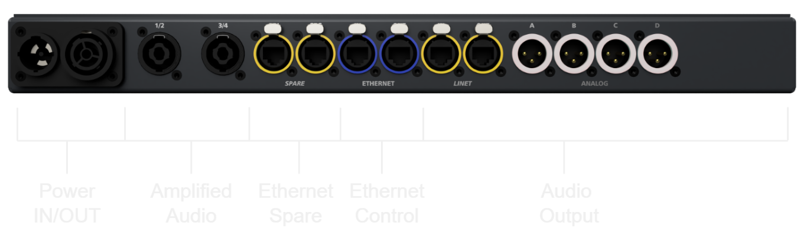

# 3 Produktbeschreibung
## 3.1 Lieferumfang
- TEQSAS PAN-C
- powerCON®TRUE1-Kabel Netzkabel
- powerCON® TRUE1 16A True1-powerCON® TRUE1 32A Verbinder
- Gebrauchsanweisung

## 3.2 Ihr Gerät im Überblick
Das TEQSAS PAN-C v2, im Folgenden PAN-C, erleichtert den Gebrauch von Coda Audio Linus 12C Systemendstufen. Die Audioeingänge sowie das Lautsprechersignal werden an der Vorderseite der Endstufe zugänglich. Durch die Möglichkeit zwischen analogem Audio oder AES/EBU (AES3) als Eingangssignal zu wählen, können auf 1HE Gerätehöhe viele Ein- und Ausgänge untergebracht werden.

<figure markdown="span">
  { loading=lazy }
  <figcaption>Abbildung 1 – Frontansicht mit Inputs und Outputs</figcaption>
</figure>

<figure markdown="span">
  { loading=lazy }
  <figcaption>Abbildung 2 - Detailansicht Front mit Buttons</figcaption>
</figure>
<figure markdown="span">
  { loading=lazy }
  <figcaption>Abbildung 3 - Ansicht der Rückseite</figcaption>
</figure>

- **Anschlüsse der Vorderseite:**
  - **Audio Inputs**
    - Analog – XLR oder RJ45
    - AES/EBU
    - LiNET
    - Netzwerkbasiertes Audio (sofern vom Verstärker unterstützt)
  - **Ethernet**
    - Anschluss des Verstärkers ins Netzwerk für Linus Control
    - LiNET-C
  - **Spare**
    - Freie Netzwerkverbindung, z.B. für Verstärker mit Dante oder anderen Netzwerk-Audio Lösungen.
  - **Amplifier Out**
    - Output der Lautsprecherkanäle, jeweils voll belegte, vierpolige Neutrik speakON®.

- **Anschlüsse der Rückseite:**
  - **Power IN/OUT**
    - Neutrik powerCON®TRUE1 16A Input
    - Neutrik powerCON®TRUE1 16A Output
  - **Amplified Audio**
    - Lautsprechersignal vom Verstärker zur Frontseite als vierpolige Neutrik speakON® ausgeführt.
  - **Spare**
    - Siehe Frontseite
  - **Ethernet**
    - Siehe Frontseite
  - **Audio Outputs**
    - Siehe Frontseite

- **Buttons an der Vorderseite:**
  - **Analog | AES/EBU**
    - Auswahl Analog oder AES/EBU an den XLR-Inputs
  - **LINET / Ethernet**
    - Wahl zwischen LiNET (8ch.) über die LiNET-Buchsen oder LiNET-C (4ch. + Control) über die Ethernet-Buchsen

## Technische Daten

| TEQSAS PAN-C                               |                 |
|--------------------------------------------|-----------------|
| zul. Umgebungstemperatur für die Benutzung | 0 – 40°C        |
| zul. Umgebungstemperatur für die Lagerung  |-20 – 50°C       |
| Abmessungen                                |482 × 180 × 44mm |
| Gewicht PAN-C                              |3040gr           |

Der Hersteller behält sich das Recht vor, technische Änderungen ohne vorherige Ankündigungen an dem Produkt / an der Produktgruppe vorzunehmen.
