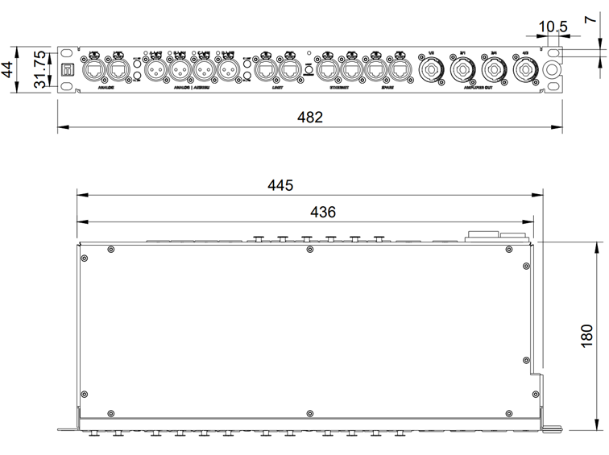
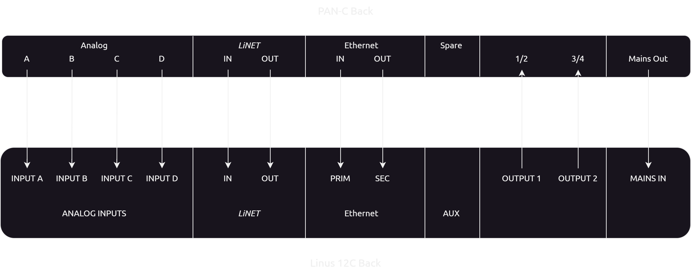

# 4 Inbetriebnahme

## 4.1 Installation

!!! info
    Benutzen Sie zur Befestigung des PAN-C im 19“-Rack immer alle vier Schrauben.

!!! warning "Warnung"
    **Wahrscheinliche Lebens- oder Verletzungsgefahr!**

    Das von der Vorderseite durchgeführte Netzkabel darf nicht gequetscht werden. Achten Sie auf eine freie Verlegung des Kabels im 19“-Rack. Im Gehäuse des PAN-C befindet sich dazu eine Aussparung.

Das PAN-C ist im 19-Zoll/1HE-Format konzipiert und zur Montage in einem Coda Audio LINUS M-RACK vorgesehen, kann aber in jedem handelsüblichen 19"-Rack verbaut werden.

 

## 4.2 Stromversorgung
!!! warning "Warnung"
    **Gefahr eines elektrischen Schlags!**
    
    Das Gerät entspricht der Geräteschutzklasse I und darf nur in Versorgungsnetzen mit Schutzleitererdung betrieben werden.
    Das Netzkabel oder der Netzstecker dürfen keine Beschädigung aufweisen. Tauschen Sie dieses im Zweifel gegen ein einwandfreies Netzkabel aus.
    Trennen Sie das Gerät vom Netz bei Gewitter oder bei längeren Phasen, in denen das Gerät nicht benutzt wird.

!!! abstract "Achtung!"
    **Gefahr von Geräteschäden!**

    Schließen Sie das Gerät nur in Versorgungsnetzen, die dem angegebenen Netzspannungsbereich entsprechen, an. Diese finden Sie auf dem Hinweisschild.

**Netzspannungsbereich:**
230V~, 50Hz, 70mA.

Der Geräteanschluss ist als Neutrik powerCON® TRUE1 ausgeführt, wobei es sich um einen schaltbaren Steckverbinder handelt. Dieser sollte jedoch nicht während der Audiowiedergabe abgesteckt werden da Coda Audio explizit darauf hinweist. Schalten Sie die LINUS 12C immer zuerst über den Schalter an der Frontseite oder mit der dafür vorgesehen Shutdown Funktion im Linus Control aus.

## 4.3 Anschluss
Das PAN-C ist dazu vorgesehen, als permanenter Ersatz für das Coda PAN-M, in Kombination mit Linus 12C Endstufen, im Coda M--Rack montiert zu werden. Dazu können alle vorhandenen Anschlüsse auf der Rückseite des PAN-C nach dem folgenden Schema verkabelt werden.

!!! warning "Warnung!"
    **Gefahr eines elektrischen Schlags!**

    Benutzen Sie zur Verbindung des Lautsprechersignals nur hochwertige Kabel mit korrekt angeschlossenen Steckern.

