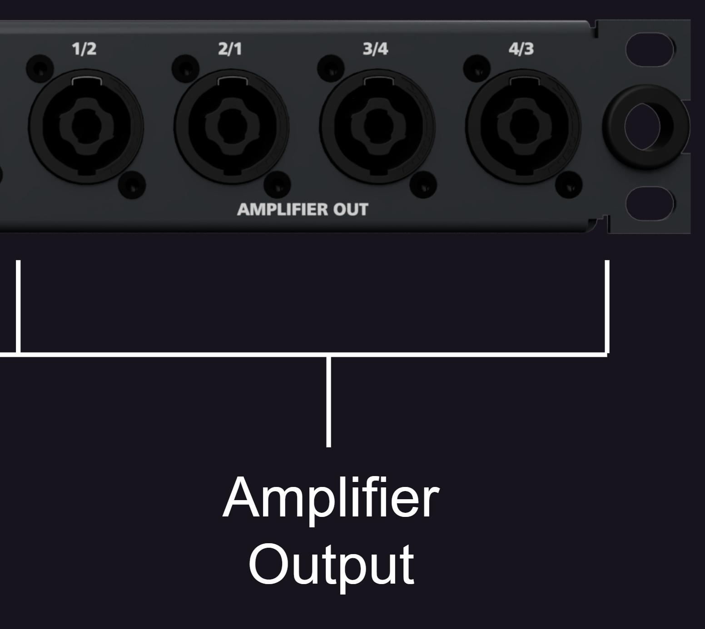

# 5 Bedienung
Das PAN-C ist mit Strom versorgt, sobald Sie den Netzstecker des Gerätes einstecken. Die Stromversorgung wird bloß für die Umschaltung auf die gewählten Inputs benötigt. Sie können das PAN-C auch ohne Strom benutzen. In diesem Fall stehen in jedoch nur die analogen Eingänge und das LiNET-C zur Verfügung.

## 5.1 Audio Inputs
**Analoge Audiosignale** können entweder über die 4 XLR-Buchsen oder über die RJ45-Buchsen eingespielt werden. Die Buchsen liegen parallel an, können also als Durchschliff genutzt werden. Achten Sie bitte darauf, je einen Inputkanal entweder über RJ45 oder XLR zu bespielen. 

**Digitale Audiosignale** können entweder im AES3(AES/EBU) Format an den XLR-Buchsen oder als Coda Audio LiNET eingespeist werden. Auch hier muss, da die Coda Audio Endstufe nur über LiNET als digitalen Audioeingang verfügt, entweder AES3 oder LiNET als Eingangssignal gewählt werden. Um LiNET-C (4ch. + Control) zu benutzen, muss das LiNET-Kabel in die Ethernet IN Buchse gesteckt werden und der Um Signale im AES3-Format zu übergeben, benutzen Sie die Buttons (siehe Abbildung 2) an den jeweiligen XLR-Buchsen, um diese entweder auf Analog-Input oder AES3-Input zu stellen. Die Status-LEDs über den XLR-Buchsen zeigen an, in welchem Modus die Buchse ist:

- Weiß – Analog Input
- Gelb – AES3 Input

!!! info "Hinweis"
    * Im stromlosen Zustand sind die XLR-Eingänge immer auf die analogen Inputs des Amps geroutet.
    * Im stromlosen Zustand ist der LiNET Modus immer auf LiNET-C eingestellt.

**Ethernet/Control** kann entweder über eine separate EthernetVerbindung verbunden werden oder über LiNET-C. In beiden Fällen verbinden Sie die Leitungen mit den beiden Ethernet-Ports. 

Mit dem Knopf LiNET/Ethernet schalten Sie die Funktion der 
Ethernet Ports um (siehe Abbildung 2). Die Farbe der Status-LED 
über dem Knopf zeigt den Modus der Ethernet-Ports an:
* Gelb – LiNET, 8ch. LiNET über die LiNET Ports, Control über Ethernet
* Blau – LiNET-C, 4ch. LiNET und Control über die Ethernet Ports

!!! info "Hinweis"
    Das PAN-C verfügt über einen EEPROM, in dem der zuletzt genutzte Modus gespeichert wird. Das gilt sowohl für die Auswahl Analog/AES3 als auch für LiNET/Ethernet. Das Gerät wird beim nächsten Start mit der gleichen Input-Konfiguration starten

Spare sind zwei durchgeschliffene Cat5e-Leitungen, welche keine direkte Anwendung mit der Coda Audio Linus 12c haben. Diese Leitungen können aber frei genutzt werden, um beispielsweise weitere Ethernet Leitungen auf die Rückseite des Racks zu führen.

## 5.2 Audio Outputs
Die vier Lautsprecherkanäle werden voll belegt auf die Vorderseite des PAN-C geführt. Die Buchsen sind als NL4 ausgeführt. Jedes Kanalpaar ist nochmal als gedrehte Version vorhanden.

!!! warning "Warnung!"
    **Gefahr eines elektrischen Schlags!**

    An den Ausgangskanälen von Verstärkern können gefährliche Spannungen auftreten. Benutzen Sie deswegen nur intakte Kabel mit korrekt angeschlossenem Stecker. Die Ausgangskanäle des Verstärkers dürfen auf keinen Fall kurzgeschlossen werden.

Die vier Lautsprecherkanäle werden voll belegt auf die Vorderseite des PAN-C geführt. Die Buchsen sind als NL4 ausgeführt. Jedes Kanalpaar ist nochmal als gedrehte Version vorhanden.

