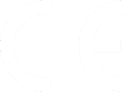

# EU-Konformitätserklärung

{ align=right }

gemäß der EU-Richtlinie 2014/30/EU (elektromagnetische Verträglichkeit) vom 26. Februar 2014, sowie 2014/35/EU (Niederspannungsrichtlinie) vom 26.Februar 2014. 

Hiermit erklären wir, dass das nachstehend bezeichnete Gerät in seiner Konzeption und Bauart sowie in der von uns in Verkehr gebrachten Ausführung den grundlegenden Sicherheits- und Gesundheitsanforderungen der EU-Richtlinie 2014/30/EU, sowie den Anforderungen an elektromagnetische Verträglichkeit, entspricht. Bei einer mit uns nicht abgestimmten Änderung des Gerätes verliert diese Erklärung ihre Gültigkeit.

**Hersteller**
---
TEQSAS GmbH  
Otto-Hahn-Straße 20a  
50354 Hürth  

Die alleinige Verantwortung für die Ausstellung dieser Konformitätserklärung trägt der Hersteller.

Beschreibung des Gerätes:  
**PAN-C v2**

sowie deren baugleiche oder bauverwandte Derivate.

---

Es wird die Übereinstimmung mit weiteren, ebenfalls für das Produkt geltenden Richtlinien / Bestimmungen / Normen erklärt:

* RoHS-Richtlinie 2011/65/EU vom 08. Juni 2011
* EN IEC 62368-1:2020 + A11:2020
* EN 55032:2015 + AC:2016 + A11:2020 + A1:2020

---

{ align=right }
Ort und Datum der Ausstellung:  Hürth, 1. Juni 2024

