# 5 Usage

## 5.1 Start sensors
* To start a sensor, click on one of the large sensor buttons on the home page of the web interface.

!!! info "Note"
    If you have connected an ATMOSPHERE to the daisy chain, you can activate it by double-clicking.

* To start all sensors, press START ALL (rocket symbol).

!!! info "Note"
    To start all connected ATMOSPHERE, click on START ATMOSPHERE (weather icon).

* To stop a sensor, click the sensor button a second time.
* To stop all sensors, click on STOP ALL (STOP symbol).

Each color indicates measured values of a specific sensor:

| Reading                          | Color  |
|----------------------------------|--------|
| Angle or height measurements     | Green  |
| Atmospheric measured values      | Blue   |
| Load Readings                    | Yellow |

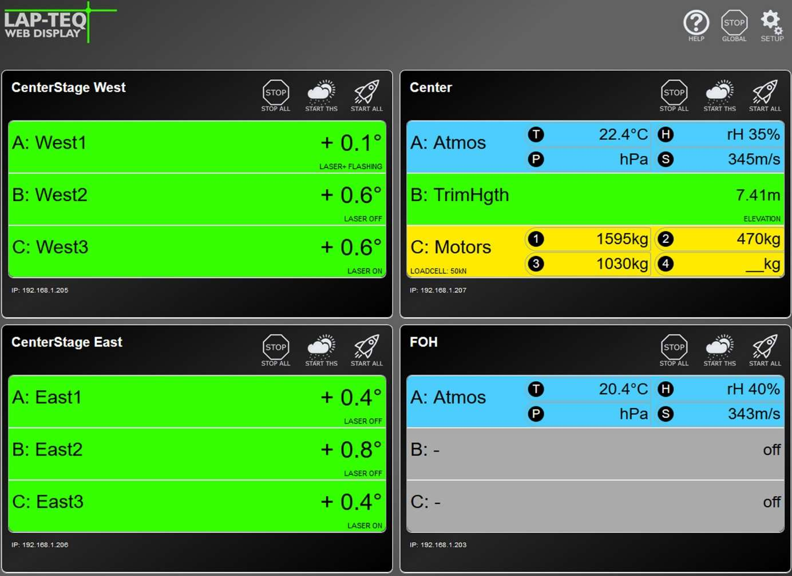

## 5.2 Software Updates

!!! abstract "Attention!"
    **Risk of equipment damage!**

    Close all browser windows with a connection to the interface. The update process takes about 60 seconds. Do not disconnect the device from power or internet during this time.

To update the firmware of the interface, you need a stable internet connection. Connect the interface to a router and enter the appropriate IP address, subnet mask and gateway address to connect to the web interface.

* Click on SETUP (gear icon).
* Click on the Update Firmware button.

After the process is finished, an update report will be displayed and the home page of the device can be loaded again.

!!! info "Note"
    If no changes are visible on the web interface, the cache of the browser must be cleared and the page must then be reloaded.

## 5.3 Reset of the interface
The device can be reset without access to the web interface. For this purpose, there is a recessed button on the front of the device, which must be pressed with a sharp object for more than 5 seconds.

The basic settings are restored during delivery. The following settings are affected:

* IP address: 192.168.1.222
* Subnet: 255.255.255.0
* Gateway: 192.168.1.1
* Sensor Names
* Notes

## 5.4 Atmosphere Analyzer
The Atmosphere Analyzer is the latest addition to the interface. This allows the transmission properties of the air to be mapped as a model. From the atmospheric measured values of the LAP-TEQ PLUS Atmosphere, a temporal change in the acoustic conditions can be displayed. The speed of sound and attenuation of the air (dissipation) depend directly on humidity and temperature. These can vary greatly from the time the system is set up to the show. In particular, the proportion of water vapour depends on temperature and pressure, which in turn changes the frequency-dependent absorption.

The Atmosphere Analyzer clearly interprets the atmospheric measured values of the LAP-TEQ PLUS Atmosphere and can provide the sound engineers with information as to whether and how the system may need to be adjusted.

!!! info "Note"
    The Atmosphere Analyzer is in an early beta phase at the time of release (16.04.2024). The scope of the software can be adjusted at any time and there is no claim to error-free functioning.

!!! info "Note"
    Detected errors can be sent to support@teqsas.de with the subject Issue Atmosphere Analyzer Beta. Please include a description of the bug as detailed as possible, the version number and other information.

The Atmosphere Analyzer is started via the icon on the Web UI interface. If the symbol is not visible, the software of the interface is not yet up to date. Please see chapter [5.2 Software Updates](manual_5.md#52-software-updates) heed.

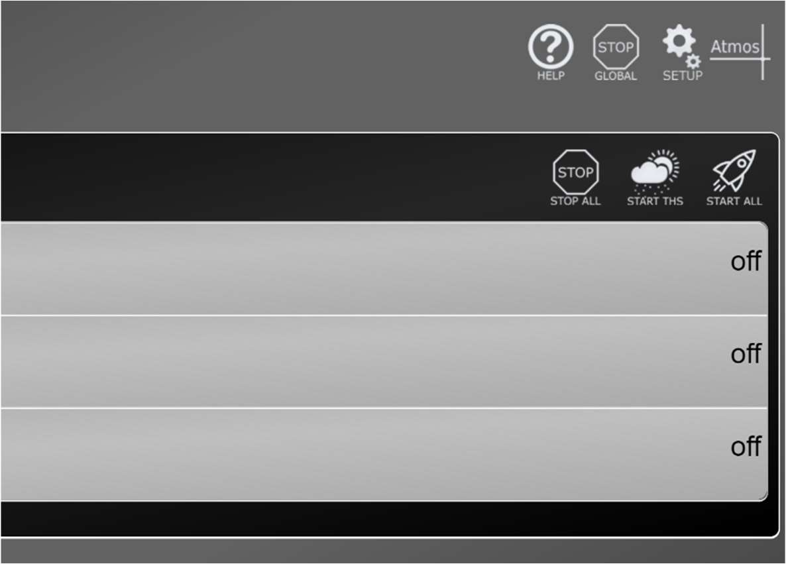

### 5.4.1 Overview
The surface is divided into three areas, at the bottom the ATMOSPHERE sensors can be added. In the area at the top left/center the attenuation of the air is displayed and to the right of it the groups are displayed.

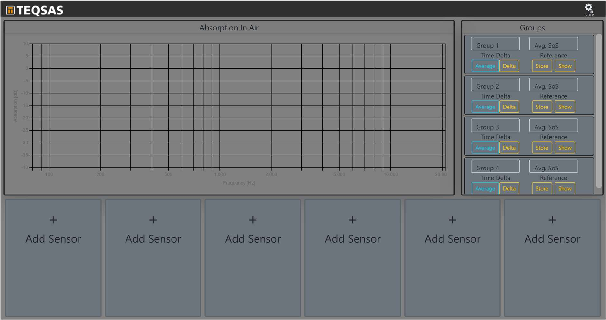

### 5.4.2 Sensor

#### Connect Sensor

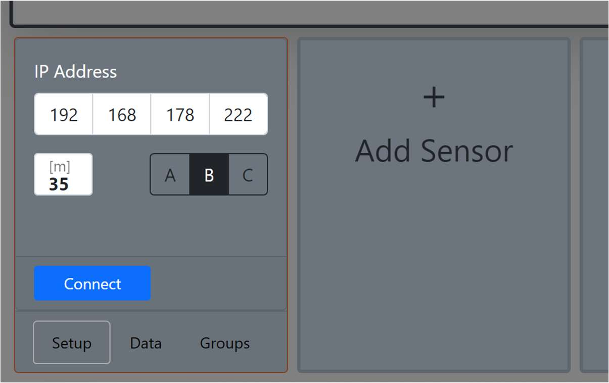{ align=left width=320 }

To add a sensor, click on one of the Add Sensor cards in the lower area. There you enter the network address of the INTERFACE and the port where the sensor is plugged in. Furthermore, the distance that is to be simulated in the model is entered here. Then you establish the connection via the Connect button.

#### Sensor functions
Once connected, the sensor's readings and the set distance are used to calculate the air absorption. If you move the mouse over the curve in the diagram, you can read the exact values.

In the area of the sensor, the current measured values are displayed and it is possible to control whether the curve should be displayed or not via the Show button. Directly below is the reference area. This becomes active as soon as you click on the Store Ref. presses. The button saves the current measured values and the curve can now also be displayed in the diagram. Only when you press the Store Ref.button, the measured values are overwritten.

The stored reference measured values can also be viewed offline. The data is stored in the browser and is therefore only available via the same browser. The measurement should therefore be carried out with the same computer that will be used to monitor later.

- Attention: the old measured values are overwritten immediately after pressing and there is currently no warning about this
- It makes sense to save the sensor immediately after connecting, as this also saves the connection data. This makes it easier to reload the page without having to reconnect all the sensors individually.

In the diagram, the curves of a sensor are displayed in the same color, with the reference measurement dashed and the live measurement solidified. Here, too, the display in the diagram can be switched on/off via the Show button.

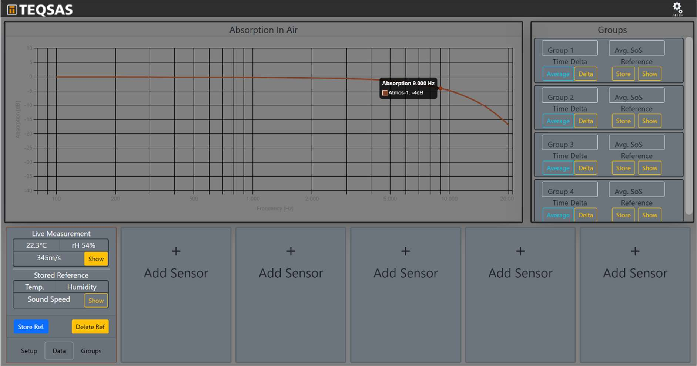

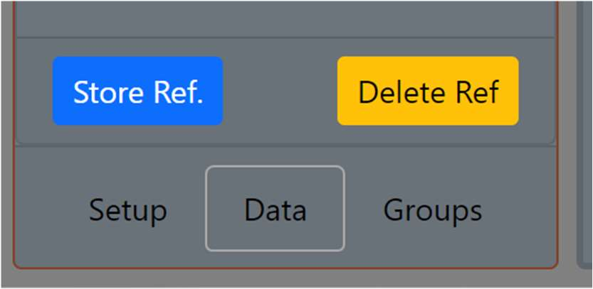{ align=left width=280 }

The Setup, Data and Groups tabs can be used to change the view of the sensor. In the Setup tab, the basic settings of the sensor can be changed. The Data tab displays the measured values and the Groups tab can be used to assign the sensor to one of four groups.

### 5.4.3 Groups
Sensors can be grouped together, and a group can consist of just a single sensor or many sensors. In the Groups tab, the sensor can be assigned to groups.

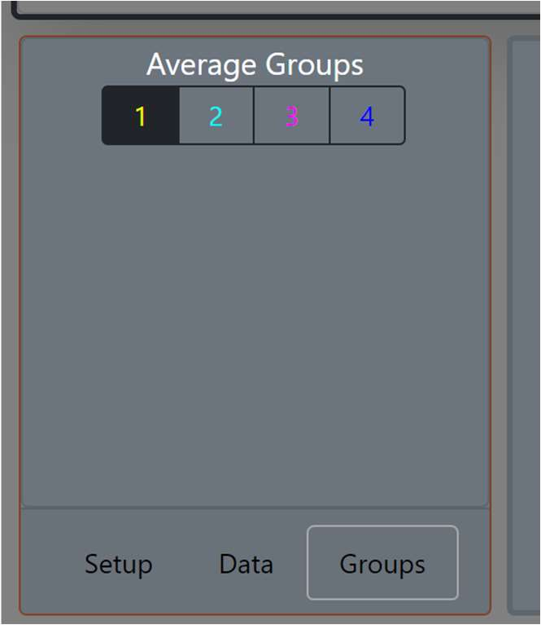{ align=left width=240 }

Once sensors have been added to a group, the group curve is displayed on the chart.

#### Group name and reference

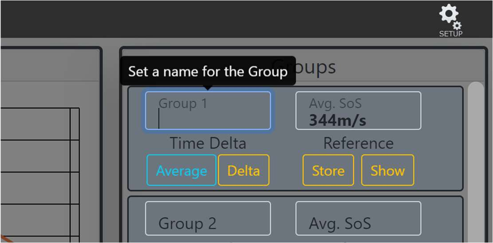{ align=right width=360 }

In the group view area, the average speed of sound is displayed. Furthermore, the name of the group can be changed. To do this, simply click in the name field and change the name. Just like a sensor, a reference of the group can also be created. This can also be viewed offline.

#### Time Delta

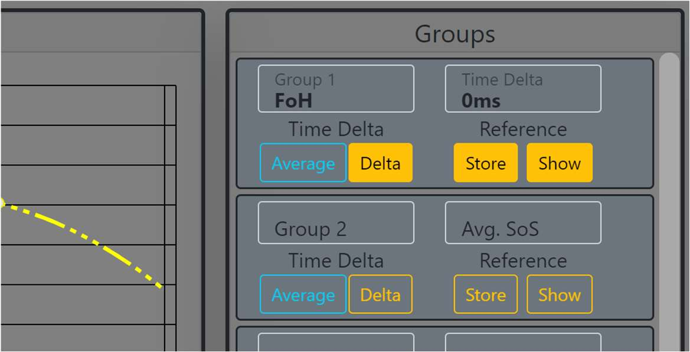{ align=right width=400 }

As soon as a reference of the group is saved and the added sensors are live, the time difference between the reference measurement and the current time can be displayed via the Delta button. This results from a change in air temperature and refers to the mean distance of the added sensors. This function is not available if the distance of a sensor has changed since the reference was saved and the current time.

#### Group Alerting

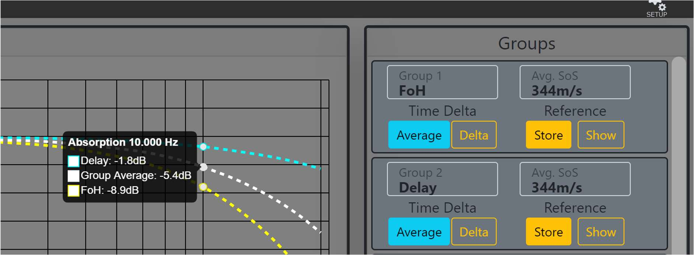

If more than one group is created, the Average button can be used to display an average of the air absorption over the groups.

### 5.4.4 Settings
The units used can be adjusted via the Setup button at the top right.

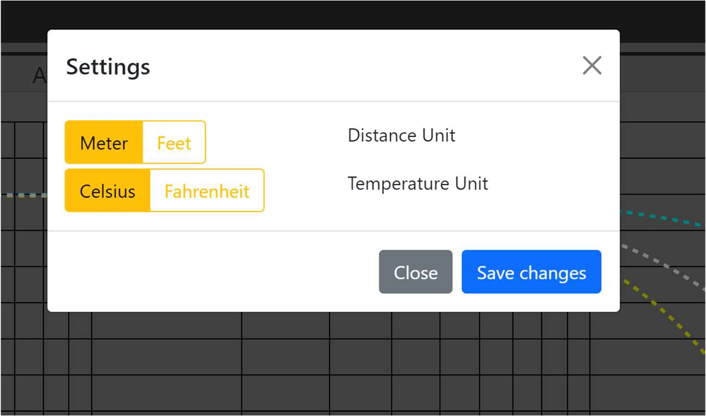{ width=480 }
