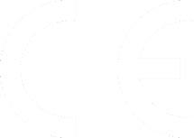
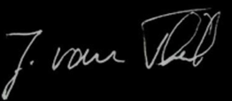

# EU Declaration of Conformity

{ align=right }

in accordance with EU Directive 2014/30/EU (Electromagnetic Compatibility) of 26 February 2014 and 2014/35/EU (Low Voltage Directive) of 26 February 2014.

We hereby declare that the device designated below, in its design and construction and in the version placed on the market by us, complies with the essential health and safety requirements of EU Directive 2014/30/EU and the requirements for electromagnetic compatibility. This declaration shall lose its validity if the device is modified without our agreement.

**Manufacturer**
---
TEQSAS GmbH  
Otto-Hahn-Straße 20a  
50354 Hürth  

The manufacturer bears sole responsibility for issuing this declaration of conformity.

Description of the device:  
**LAP-TEQ PLUS**

and its identical or similar derivatives.

---

<!-- TODO: Add further directives/standards from the original CE document if applicable -->

---

{ align=right }
Place and date of issue:  Hürth, 16 November 2018
