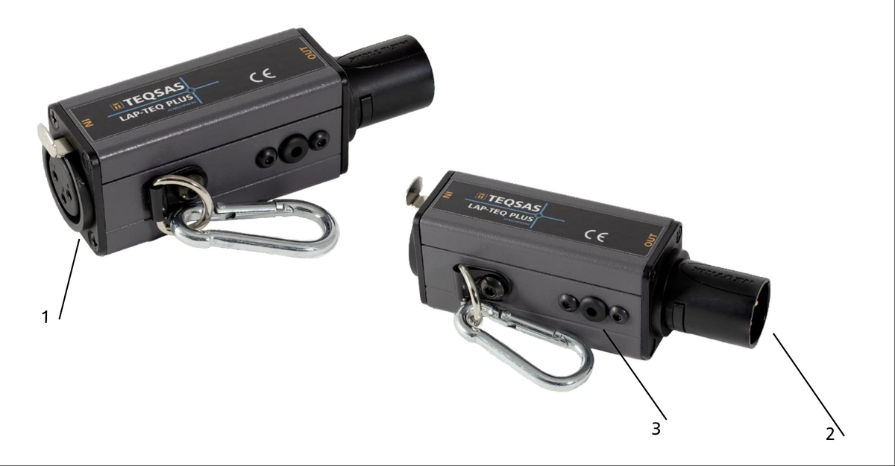

# 3 Product Description

## 3.1 Your device at a glance

1. LAP-TEQ Port for additional sensors in daisy-chain operation
2. Output for measurement data
3. Pressure compensation valve for temperature, humidity and pressure sensor
