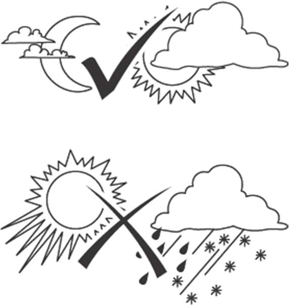

# 7 Issues and Help

!!! warning "Caution!"
    **Risk of injury!**

    Improper repairs can result in your appliance no longer functioning safely. You are putting yourself and your surroundings at risk

It is often only minor faults that lead to a malfunction. In most cases, you can easily rectify these yourself. Please refer to the following table before contacting your dealer. This will save you a lot of trouble and possibly also costs.

If the device requires servicing, take it to your sales partner.

| Error/Fault                                       | Cause                                              | Remedy                                                                                                                                                                          |
|---------------------------------------------------|----------------------------------------------------|---------------------------------------------------------------------------------------------------------------------------------------------------------------------------------|
| Device does not work                              | Device defective?                                  | Contact service                                                                                                                                                                 |
| Laser not visible                                 | Poor ambient conditions?                           | See note on ambient conditions in this manual                                                                                                                                   |
|                                                   | Cable too long?                                    | Use a QLX cable with a larger cross-section                                                                                                                                     |
|                                                   | Measurement distance too long?                     | If possible, reduce the measurement distance                                                                                                                                    |
| "?.?m" or "?.?ft" appears on the display          | The device cannot find an end point for the measurement | Check the measurement end point and/or the line of sight. Can the ELEVATION module swing freely? Place reflective material (paper) on the measurement end point.            |
| Three dashes appear on the display                | XLR cable not correctly plugged in                 | Push the XLR cable in firmly                                                                                                                                                    |

If you cannot rectify the fault yourself, please contact our service team directly. Please note that improper repairs will also invalidate the warranty and you may incur additional costs.

## 7.1 Service centre

    TEQSAS GmbH
    Otto-Hahn-Straße 20a
    50354 Hürth
    Deutschland
    Tel.: +49 (0)2233 611-500
    E-Mail: service@teqsas.de

## 7.2 Observe ambient conditions

The visibility of the laser beam depends on the ambient brightness. As a general rule:

* Subdued light = good visibility
* Direct sunlight = poor visibility
* Rain, dust or steam = poor visibility

Other adverse influences:

* Measurements through glass or plastic panes
* Contaminated laser outlet
* Strong temperature fluctuations: always allow the device to acclimatise in the transport case for some time before use in very cold or warm environments.
