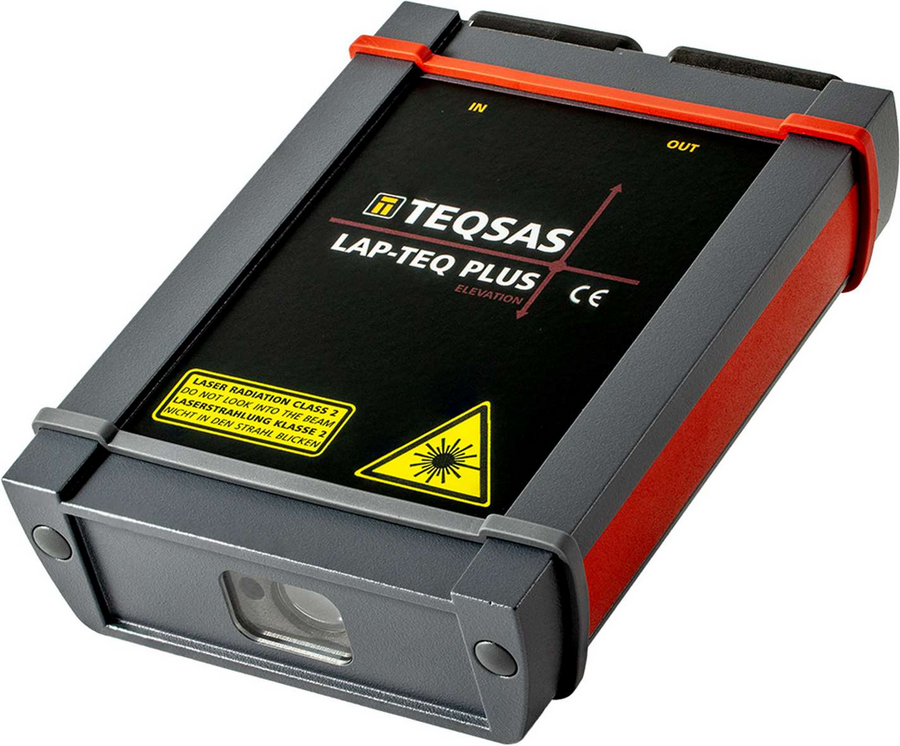

# TEQSAS LAP-TEQ PLUS Elevation

This is the collection of documents for the TEQSAS LAP-TEQ PLUS Elevation.

-   :octicons-book-16: __Manual__

    ---

    [To the manual](./Manual/manual_1.md)

-   :octicons-shield-check-16: __CE Conformity__

    ---

    [To the declaration](./Manual/manual_ce.md)

-   :octicons-graph-16: __Technical Data__

    ---

    [To the data](./Manual/manual_11.md)

